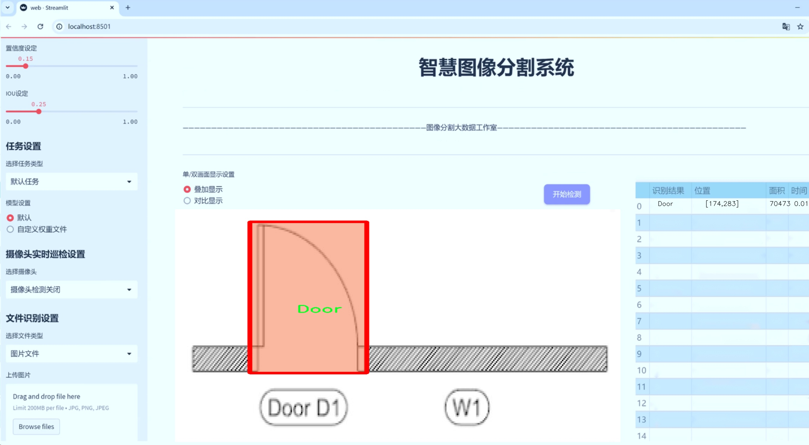
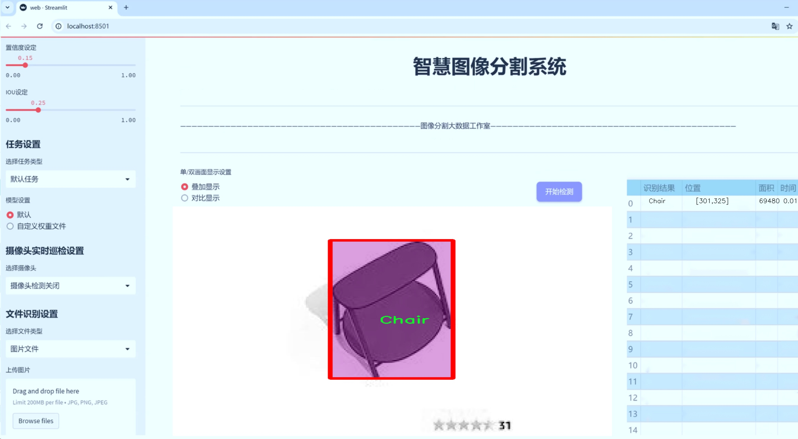
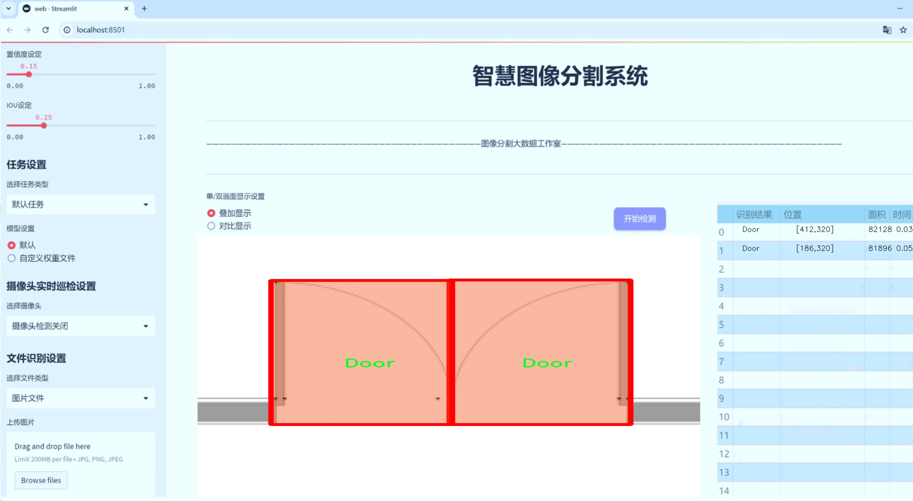
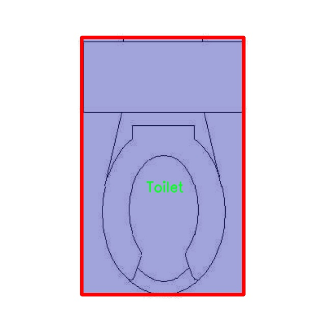
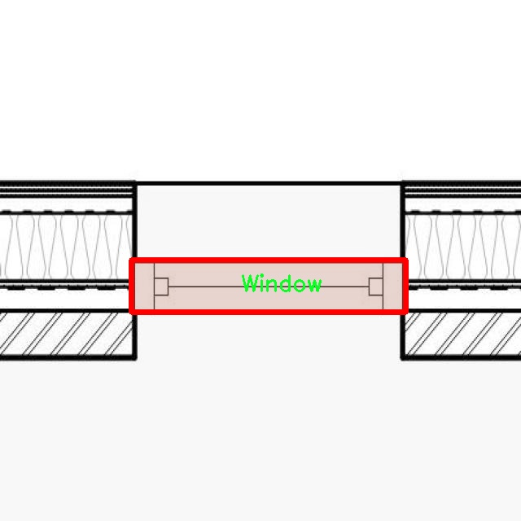
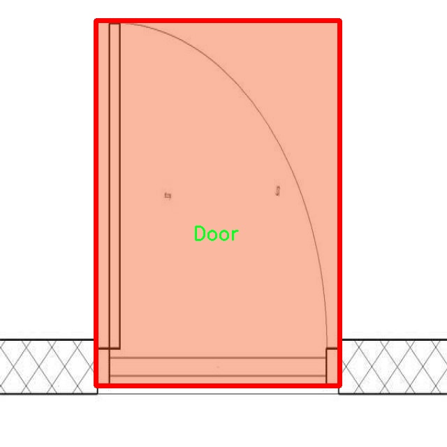
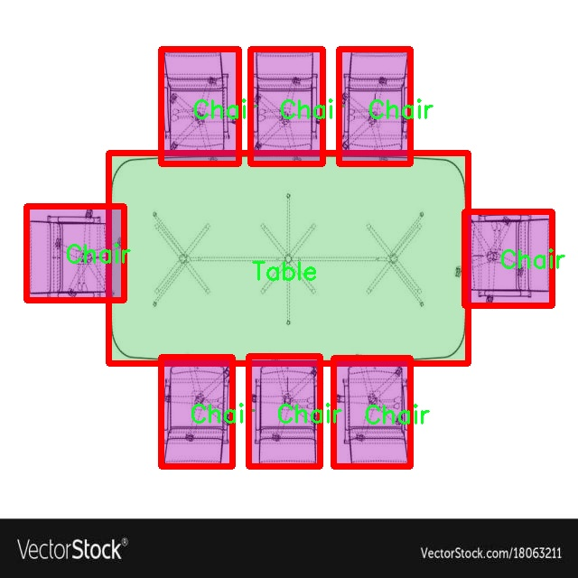
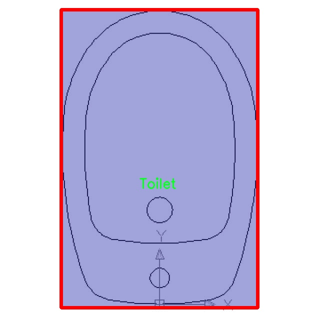

# 家具标示图分割系统源码＆数据集分享
 [yolov8-seg-C2f-SCcConv＆yolov8-seg-p2等50+全套改进创新点发刊_一键训练教程_Web前端展示]

### 1.研究背景与意义

项目参考[ILSVRC ImageNet Large Scale Visual Recognition Challenge](https://gitee.com/YOLOv8_YOLOv11_Segmentation_Studio/projects)

项目来源[AAAI Global Al lnnovation Contest](https://kdocs.cn/l/cszuIiCKVNis)

研究背景与意义

随着智能家居和室内设计行业的快速发展，家具标示图的自动化处理需求日益增加。传统的家具识别和分割方法往往依赖于人工标注和经验判断，效率低下且易受主观因素影响。近年来，深度学习技术的飞速进步为解决这一问题提供了新的思路，尤其是目标检测和实例分割领域的研究成果，为家具图像的自动识别和分割提供了强有力的技术支持。在此背景下，基于改进YOLOv8的家具标示图分割系统应运而生，旨在提高家具识别的准确性和效率。

YOLO（You Only Look Once）系列模型以其快速和高效的特性广受欢迎，尤其在实时目标检测中表现突出。YOLOv8作为该系列的最新版本，进一步提升了模型的性能和适用性。通过对YOLOv8的改进，我们可以针对家具图像的特征进行更为精细的调整，以实现更高的分割精度和更低的计算成本。具体而言，本研究将利用包含1500张图像和27个类别的家具数据集，进行模型训练和评估。这些类别涵盖了家庭生活中常见的家具和设施，如床、沙发、书柜、厨房台面等，具有较强的实用性和广泛的应用前景。

数据集的丰富性和多样性为模型的训练提供了良好的基础。通过对不同类型家具的标注，模型能够学习到家具在不同环境和角度下的特征，从而提高其在实际应用中的泛化能力。此外，数据集中包含的房间类型（如卧室、厨房、客厅等）也为模型提供了上下文信息，使其在识别家具时能够考虑到空间布局和功能性。这种多层次的信息融合，将显著提升模型的识别和分割效果。

在实际应用中，基于改进YOLOv8的家具标示图分割系统不仅可以用于室内设计软件的自动化工具，还可以为智能家居系统提供实时的家具识别服务。例如，在智能家居控制系统中，能够快速识别出用户所处房间的家具配置，从而提供个性化的智能服务。此外，该系统还可以应用于虚拟现实（VR）和增强现实（AR）技术中，帮助用户在虚拟环境中进行家具摆放和室内设计，提升用户体验。

综上所述，基于改进YOLOv8的家具标示图分割系统的研究具有重要的理论价值和实际意义。它不仅推动了深度学习在家具识别领域的应用研究，也为智能家居和室内设计行业的技术进步提供了新的解决方案。通过本研究的深入开展，我们期望能够为家具标示图的自动化处理提供更为高效和准确的技术支持，助力相关领域的进一步发展。

### 2.图片演示







##### 注意：由于此博客编辑较早，上面“2.图片演示”和“3.视频演示”展示的系统图片或者视频可能为老版本，新版本在老版本的基础上升级如下：（实际效果以升级的新版本为准）

  （1）适配了YOLOV8的“目标检测”模型和“实例分割”模型，通过加载相应的权重（.pt）文件即可自适应加载模型。

  （2）支持“图片识别”、“视频识别”、“摄像头实时识别”三种识别模式。

  （3）支持“图片识别”、“视频识别”、“摄像头实时识别”三种识别结果保存导出，解决手动导出（容易卡顿出现爆内存）存在的问题，识别完自动保存结果并导出到tempDir中。

  （4）支持Web前端系统中的标题、背景图等自定义修改，后面提供修改教程。

  另外本项目提供训练的数据集和训练教程,暂不提供权重文件（best.pt）,需要您按照教程进行训练后实现图片演示和Web前端界面演示的效果。

### 3.视频演示

[3.1 视频演示](https://www.bilibili.com/video/BV1DN24Y7Epi/)

### 4.数据集信息展示

##### 4.1 本项目数据集详细数据（类别数＆类别名）

nc: 26
names: ['Bathtub', 'Bed', 'Carpet - Mat', 'Chair', 'Chest - Wardrobe', 'Desk', 'Door', 'Kitchen_Counter', 'Kitchen_Sink', 'Lamp', 'Plant', 'Refrigerator', 'Room_Bathroom', 'Room_Bedroom', 'Room_Generic_Room', 'Room_Kitchen', 'Room_Living_Room', 'Room_Office', 'Shower', 'Sofa', 'Stairs - Staircase', 'TV', 'Table', 'Toilet', 'Wash_Basin', 'Window']


##### 4.2 本项目数据集信息介绍

数据集信息展示

在本研究中，我们采用了名为“phd-plan-recog-c-1bedroom”的数据集，以训练和改进YOLOv8-seg的家具标示图分割系统。该数据集专注于一居室环境，包含了丰富的家具和房间类型，为我们的模型提供了多样化的训练样本。数据集的类别数量为26，涵盖了从家具到房间的多种元素，这些元素在实际应用中具有重要的识别和分割价值。

具体而言，数据集中包含的类别包括：浴缸（Bathtub）、床（Bed）、地毯（Carpet - Mat）、椅子（Chair）、衣柜（Chest - Wardrobe）、书桌（Desk）、门（Door）、厨房台面（Kitchen_Counter）、厨房水槽（Kitchen_Sink）、灯（Lamp）、植物（Plant）、冰箱（Refrigerator）、卫生间（Room_Bathroom）、卧室（Room_Bedroom）、通用房间（Room_Generic_Room）、厨房（Room_Kitchen）、客厅（Room_Living_Room）、办公室（Room_Office）、淋浴（Shower）、沙发（Sofa）、楼梯（Stairs - Staircase）、电视（TV）、桌子（Table）、厕所（Toilet）、洗手盆（Wash_Basin）以及窗户（Window）。这些类别的多样性不仅为模型提供了丰富的训练数据，还确保了其在不同场景下的适应性和鲁棒性。

数据集的设计旨在模拟真实居住环境中的家具布局，使得模型能够在复杂的场景中有效地进行物体检测和分割。每个类别的样本都经过精心标注，确保了高质量的训练数据。这种高质量的标注对于深度学习模型的训练至关重要，因为它直接影响到模型的学习效果和最终的性能表现。

在数据预处理阶段，我们对数据集进行了多种增强处理，以提高模型的泛化能力。例如，通过旋转、缩放、翻转等方式，增加了数据的多样性，使得模型能够更好地适应不同的视角和光照条件。此外，数据集中不同类别的样本数量经过均衡处理，确保每个类别在训练过程中都能得到充分的学习机会，避免了类别不平衡对模型性能的负面影响。

在训练过程中，我们将使用YOLOv8-seg这一先进的目标检测和分割框架，结合“phd-plan-recog-c-1bedroom”数据集的特性，力求实现高精度的家具标示和分割。YOLOv8-seg的高效性和实时性使其成为家具识别任务的理想选择，能够在保证准确率的同时，实现快速的推理速度。

通过本次研究，我们希望能够在家具标示和图像分割领域取得显著进展，为智能家居、室内设计等应用提供更为精准的技术支持。数据集“phd-plan-recog-c-1bedroom”的使用，将为我们的研究提供坚实的基础，推动相关技术的发展和应用。











### 5.全套项目环境部署视频教程（零基础手把手教学）

[5.1 环境部署教程链接（零基础手把手教学）](https://www.bilibili.com/video/BV1jG4Ve4E9t/?vd_source=bc9aec86d164b67a7004b996143742dc)


[5.2 安装Python虚拟环境创建和依赖库安装视频教程链接（零基础手把手教学）](https://www.bilibili.com/video/BV1nA4VeYEze/?vd_source=bc9aec86d164b67a7004b996143742dc)

### 6.手把手YOLOV8-seg训练视频教程（零基础小白有手就能学会）

[6.1 手把手YOLOV8-seg训练视频教程（零基础小白有手就能学会）](https://www.bilibili.com/video/BV1cA4VeYETe/?vd_source=bc9aec86d164b67a7004b996143742dc)


按照上面的训练视频教程链接加载项目提供的数据集，运行train.py即可开始训练



     Epoch   gpu_mem       box       obj       cls    labels  img_size
     1/200     0G   0.01576   0.01955  0.007536        22      1280: 100%|██████████| 849/849 [14:42<00:00,  1.04s/it]
               Class     Images     Labels          P          R     mAP@.5 mAP@.5:.95: 100%|██████████| 213/213 [01:14<00:00,  2.87it/s]
                 all       3395      17314      0.994      0.957      0.0957      0.0843

     Epoch   gpu_mem       box       obj       cls    labels  img_size
     2/200     0G   0.01578   0.01923  0.007006        22      1280: 100%|██████████| 849/849 [14:44<00:00,  1.04s/it]
               Class     Images     Labels          P          R     mAP@.5 mAP@.5:.95: 100%|██████████| 213/213 [01:12<00:00,  2.95it/s]
                 all       3395      17314      0.996      0.956      0.0957      0.0845

     Epoch   gpu_mem       box       obj       cls    labels  img_size
     3/200     0G   0.01561    0.0191  0.006895        27      1280: 100%|██████████| 849/849 [10:56<00:00,  1.29it/s]
               Class     Images     Labels          P          R     mAP@.5 mAP@.5:.95: 100%|███████   | 187/213 [00:52<00:00,  4.04it/s]
                 all       3395      17314      0.996      0.957      0.0957      0.0845


### 7.50+种全套YOLOV8-seg创新点代码加载调参视频教程（一键加载写好的改进模型的配置文件）

[7.1 50+种全套YOLOV8-seg创新点代码加载调参视频教程（一键加载写好的改进模型的配置文件）](https://www.bilibili.com/video/BV1Hw4VePEXv/?vd_source=bc9aec86d164b67a7004b996143742dc)

### 8.YOLOV8-seg图像分割算法原理

原始YOLOv8-seg算法原理

YOLOv8-seg算法是Ultralytics公司在2023年推出的最新目标检测和图像分割模型，代表了YOLO系列算法的又一次重大进步。YOLOv8的设计理念是追求快速、准确和易于使用，使其在各种计算机视觉任务中都能表现出色。与前几代YOLO模型相比，YOLOv8在网络结构、损失函数以及数据处理等多个方面进行了创新和优化，旨在提升模型的性能和灵活性。

首先，YOLOv8的输入部分采用了640x640的默认图像尺寸，但为了适应不同长宽比的图像，模型在推理时实现了自适应图像缩放。这种方法通过将长边按比例缩小到指定尺寸，并对短边进行填充，减少了信息冗余，提升了目标检测的速度和准确性。此外，YOLOv8在训练过程中引入了Mosaic数据增强技术，该技术通过随机选择四张图像进行缩放和拼接，生成新的训练样本。这种增强方式有效地迫使模型学习不同位置和周围像素的特征，从而提高了模型的泛化能力和预测精度。

在网络结构方面，YOLOv8的主干网络（Backbone）进行了显著改进。YOLOv8采用了C2F模块替代了YOLOv5中的C3模块，C2F模块通过增加更多的梯度流分支，增强了特征表示能力。这种设计不仅保持了模型的轻量化特性，还提升了精度和推理速度。C2F模块的结构灵活多变，能够更好地适应不同规模的目标物体，进而提高检测的准确性。

YOLOv8的Neck部分同样经历了重构，去除了YOLOv5中两次上采样前的1x1卷积连接层，直接对Backbone不同阶段输出的特征进行上采样。这种简化使得特征融合更加高效，减少了计算复杂度，进一步提升了模型的实时性。Neck部分采用了路径聚合网络（PAN）结构，能够有效地增强对不同尺度对象的特征融合能力，使得模型在处理多尺度目标时表现更加优异。

在Head部分，YOLOv8进行了最为显著的变化。传统的耦合头（Coupled-Head）被解耦头（Decoupled-Head）所取代，这一变化使得检测和分类过程分开进行，分别通过不同的卷积模块进行处理。这种解耦设计不仅提高了模型的灵活性，还减少了训练过程中的逻辑不一致性。此外，YOLOv8摒弃了传统的Anchor-Based方法，转而采用Anchor-Free的检测策略。这一策略将目标检测转化为关键点检测，避免了预设锚框带来的灵活性不足和计算复杂度高的问题，极大地提升了模型的泛化能力。

YOLOv8的损失函数设计也经过了优化。在分类分支中，YOLOv8使用了二元交叉熵损失（BCELoss），而在边界框回归分支中则结合了分布焦点损失（DFL）和完全交并比损失（CIOULoss）。这种设计使得模型能够快速聚焦于标签附近的数值，提高了边界框预测的准确性，进而提升了整体检测性能。

总的来说，YOLOv8-seg算法通过一系列创新和优化，提升了目标检测和图像分割的性能，尤其是在处理复杂场景和多尺度目标时表现出色。其结构设计的灵活性和高效性，使得YOLOv8在实际应用中能够快速适应不同的任务需求，成为计算机视觉领域中的一款强大工具。随着YOLOv8的推广和应用，预计将会在智能监控、自动驾驶、医疗影像分析等多个领域发挥重要作用，推动相关技术的进一步发展。


### 9.系统功能展示（检测对象为举例，实际内容以本项目数据集为准）

图9.1.系统支持检测结果表格显示

  图9.2.系统支持置信度和IOU阈值手动调节

  图9.3.系统支持自定义加载权重文件best.pt(需要你通过步骤5中训练获得)

  图9.4.系统支持摄像头实时识别

  图9.5.系统支持图片识别

  图9.6.系统支持视频识别

  图9.7.系统支持识别结果文件自动保存

  图9.8.系统支持Excel导出检测结果数据


### 10.50+种全套YOLOV8-seg创新点原理讲解（非科班也可以轻松写刊发刊，V11版本正在科研待更新）

#### 10.1 由于篇幅限制，每个创新点的具体原理讲解就不一一展开，具体见下列网址中的创新点对应子项目的技术原理博客网址【Blog】：


[10.1 50+种全套YOLOV8-seg创新点原理讲解链接](https://gitee.com/qunmasj/good)

#### 10.2 部分改进模块原理讲解(完整的改进原理见上图和技术博客链接)【此小节的图要是加载失败请移步原始博客查看，链接：https://blog.csdn.net/cheng2333333?type=blog】
### YOLOv8简介

YOLOv8是一种最新的SOTA算法，提供了N/S/M/L/X尺度的不同大小模型，以满足不同场景的需求。本章对算法网络的新特性进行简要介绍。


1）骨干网络和Neck
开发者设计了C2f模块对CSPDarkNet 53和PAFPN进行改造。相比C3模块，C2f模块拥有更多的分支跨层链接，使模型的梯度流更加丰富，显著增强了模型的特征提取能力。
2)Head部分
Head部分采用无锚框设计，将分类任务和回归任务进行了解耦，独立的分支将更加专注于其所负责的特征信息。
3）损失计算
模型使用CIOU Loss作为误差损失函数，并通过最小化DFL进一步提升边界框的回归精度。同时模型采用了TaskAlignedAssigner样本分配策略，以分类得分和IOU的高阶组合作为指标指导正负样本选择，实现了高分类得分和高IOU的对齐，有效地提升了模型的检测精度。


### D-LKA Attention简介
自2010年代中期以来，卷积神经网络（CNNs）已成为许多计算机视觉应用的首选技术。它们能够从原始数据中自动提取复杂的特征表示，无需手动进行特征工程，这引起了医学图像分析社区的极大兴趣。许多成功的CNN架构，如U-Net、全卷积网络、DeepLab或SegCaps（分割胶囊），已经被开发出来。这些架构在语义分割任务中取得了巨大成功，先前的最新方法已经被超越。

在计算机视觉研究中，不同尺度下的目标识别是一个关键问题。在CNN中，可检测目标的大小与相应网络层的感受野尺寸密切相关。如果一个目标扩展到超出这个感受野的边界，这可能会导致欠分割结果。相反，与目标实际大小相比使用过大的感受野可能会限制识别，因为背景信息可能会对预测产生不必要的影响。

解决这个问题的一个有希望的方法涉及在并行使用具有不同尺寸的多个Kernel，类似于Inception块的机制。然而，由于参数和计算要求的指数增长，将Kernel大小增加以容纳更大的目标在实践中受到限制。因此，出现了各种策略，包括金字塔池化技术和不同尺度的扩张卷积，以捕获多尺度的上下文信息。

另一个直观的概念涉及将多尺度图像金字塔或它们的相关特征表示直接纳入网络架构。然而，这种方法存在挑战，特别是在管理训练和推理时间方面的可行性方面存在挑战。在这个背景下，使用编码器-解码器网络，如U-Net，已被证明是有利的。这样的网络在较浅的层中编码外观和位置，而在更深的层中，通过神经元的更广泛的感受野捕获更高的语义信息和上下文信息。

一些方法将来自不同层的特征组合在一起，或者预测来自不同尺寸的层的特征以使用多尺度的信息。此外，出现了从不同尺度的层中预测特征的方法，有效地实现了跨多个尺度的见解整合。然而，大多数编码器-解码器结构面临一个挑战：它们经常无法在不同尺度之间保持一致的特征，并主要使用最后一个解码器层生成分割结果。

语义分割是一项任务，涉及根据预定义的标签集为图像中的每个像素预测语义类别。这项任务要求提取高级特征同时保留初始的空间分辨率。CNNs非常适合捕获局部细节和低级信息，尽管以忽略全局上下文为代价。视觉Transformer（ViT）架构已经成为解决处理全局信息的视觉任务的关键，包括语义分割，取得了显著的成功。

ViT的基础是注意力机制，它有助于在整个输入序列上聚合信息。这种能力使网络能够合并远程的上下文提示，超越了CNN的有限感受野尺寸。然而，这种策略通常会限制ViT有效建模局部信息的能力。这种局限可能会妨碍它们检测局部纹理的能力，这对于各种诊断和预测任务至关重要。这种缺乏局部表示可以归因于ViT模型处理图像的特定方式。

ViT模型将图像分成一系列Patch，并使用自注意力机制来模拟它们之间的依赖关系。这种方法可能不如CNN模型中的卷积操作对感受野内提取局部特征有效。ViT和CNN模型之间的这种图像处理方法的差异可能解释了CNN模型在局部特征提取方面表现出色的原因。

近年来，已经开发出创新性方法来解决Transformer模型内部局部纹理不足的问题。其中一种方法是通过互补方法将CNN和ViT特征结合起来，以结合它们的优势并减轻局部表示的不足。TransUNet是这种方法的早期示例，它在CNN的瓶颈中集成了Transformer层，以模拟局部和全局依赖关系。HiFormer提出了一种解决方案，将Swin Transformer模块和基于CNN的编码器结合起来，生成两个多尺度特征表示，通过Double-Level Fusion模块集成。UNETR使用基于Transformer的编码器和CNN解码器进行3D医学图像分割。CoTr和TransBTS通过Transformer在低分辨率阶段增强分割性能，将CNN编码器和解码器连接在一起。

增强局部特征表示的另一种策略是重新设计纯Transformer模型内部的自注意力机制。在这方面，Swin-Unet在U形结构中集成了一个具有线性计算复杂性的Swin Transformer块作为多尺度 Backbone 。MISSFormer采用高效Transformer来解决视觉Transformer中的参数问题，通过在输入块上进行不可逆的降采样操作。D-Former引入了一个纯Transformer的管道，具有双重注意模块，以分段的方式捕获细粒度的局部注意和与多元单元的交互。然而，仍然存在一些特定的限制，包括计算效率低下，如TransUNet模型所示，对CNN Backbone 的严重依赖，如HiFormer所观察到的，以及对多尺度信息的忽略。

此外，目前的分割架构通常采用逐层处理3D输入 volumetric 的方法，无意中忽视了相邻切片之间的潜在相关性。这一疏忽限制了对 volumetric 信息的全面利用，因此损害了定位精度和上下文集成。此外，必须认识到，医学领域的病变通常在形状上发生变形。因此，用于医学图像分析的任何学习算法都必须具备捕捉和理解这些变形的能力。与此同时，该算法应保持计算效率，以便处理3D volumetric数据。

为了解决上述提到的挑战，作者提出了一个解决方案，即可变形大卷积核注意力模块（Deformable LKA module），它是作者网络设计的基本构建模块。这个模块明确设计成在有效处理上下文信息的同时保留局部描述符。作者的架构在这两个方面的平衡增强了实现精确语义分割的能力。

值得注意的是，参考该博客引入了一种基于数据的感受野的动态适应，不同于传统卷积操作中的固定滤波器Mask。这种自适应方法使作者能够克服与静态方法相关的固有限制。这种创新方法还扩展到了D-LKA Net架构的2D和3D版本的开发。

在3D模型的情况下，D-LKA机制被量身定制以适应3D环境，从而实现在不同 volumetric 切片之间无缝信息交互。最后，作者的贡献通过其计算效率得到进一步强调。作者通过仅依靠D-LKA概念的设计来实现这一点，在各种分割基准上取得了显著的性能，确立了作者的方法作为一种新的SOTA方法。

在本节中，作者首先概述方法论。首先，作者回顾了由Guo等人引入的大卷积核注意力（Large Kernel Attention，LKA）的概念。然后，作者介绍了作者对可变形LKA模块的创新探索。在此基础上，作者介绍了用于分割任务的2D和3D网络架构。

大卷积核提供了与自注意力机制类似的感受野。可以通过使用深度卷积、深度可扩展卷积和卷积来构建大卷积核，从而减少了参数和计算量。构建输入维度为和通道数的卷积核的深度卷积和深度可扩展卷积的卷积核大小的方程如下：


具有卷积核大小和膨胀率。参数数量和浮点运算（FLOPs）的计算如下：


FLOPs的数量与输入图像的大小成线性增长。参数的数量随通道数和卷积核大小的增加而呈二次增长。然而，由于它们通常都很小，因此它们不是限制因素。

为了最小化对于固定卷积核大小K的参数数量，可以将方程3对于膨胀率的导数设定为零：


例如，当卷积核大小为时，结果是。将这些公式扩展到3D情况是直接的。对于大小为和通道数C的输入，3D情况下参数数量和FLOPs 的方程如下：


具有卷积核大小和膨胀。


利用大卷积核进行医学图像分割的概念通过引入可变形卷积得以扩展。可变形卷积可以通过整数偏移自由调整采样网格以进行自由变形。额外的卷积层从特征图中学习出变形，从而创建一个偏移场。基于特征本身学习变形会导致自适应卷积核。这种灵活的卷积核形状可以提高病变或器官变形的表示，从而增强了目标边界的定义。

负责计算偏移的卷积层遵循其相应卷积层的卷积核大小和膨胀。双线性插值用于计算不在图像网格上的偏移的像素值。如图2所示，D-LKA模块可以表示为：


其中输入特征由表示，。表示为注意力图，其中每个值表示相应特征的相对重要性。运算符  表示逐元素乘法运算。值得注意的是，LKA不同于传统的注意力方法，它不需要额外的规范化函数，如或。这些规范化函数往往忽视高频信息，从而降低了基于自注意力的方法的性能。

在该方法的2D版本中，卷积层被可变形卷积所替代，因为可变形卷积能够改善对具有不规则形状和大小的目标的捕捉能力。这些目标在医学图像数据中常常出现，因此这种增强尤为重要。

然而，将可变形LKA的概念扩展到3D领域会带来一定的挑战。主要的约束来自于需要用于生成偏移的额外卷积层。与2D情况不同，由于输入和输出通道的性质，这一层无法以深度可分的方式执行。在3D环境中，输入通道对应于特征，而输出通道扩展到，其中是卷积核的大小。大卷积核的复杂性导致沿第3D的通道数扩展，导致参数和FLOPs大幅增加。因此，针对3D情况采用了另一种替代方法。在现有的LKA框架中，深度卷积之后引入了一个单独的可变形卷积层。这种战略性的设计调整旨在减轻扩展到3D领域所带来的挑战。


2D网络的架构如图1所示。第一变种使用MaxViT作为编码器组件，用于高效特征提取，而第二变种则结合可变形LKA层进行更精细、卓越的分割。

在更正式的描述中，编码器生成4个分层输出表示。首先，卷积干扰将输入图像的维度减小到。随后，通过4个MaxViT块的4个阶段进行特征提取，每个阶段后跟随降采样层。随着过程进展到解码器，实施了4个阶段的D-LKA层，每个阶段包含2个D-LKA块。然后，应用Patch扩展层以实现分辨率上采样，同时减小通道维度。最后，线性层负责生成最终的输出。

2D D-LKA块的结构包括LayerNorm、可变形LKA和多层感知器（MLP）。积分残差连接确保了有效的特征传播，即使在更深层也是如此。这个安排可以用数学方式表示为：


其中输入特征，层归一化LN，可变形LKA注意力，深度卷积，线性层和GeLU激活函数。

3D网络架构如图1所示，采用编码器-解码器设计进行分层结构化。首先，一个Patch嵌入层将输入图像的维度从（）减小到（）。在编码器中，采用了3个D-LKA阶段的序列，每个阶段包含3个D-LKA块。在每个阶段之后，通过降采样步骤将空间分辨率减半，同时将通道维度加倍。中央瓶颈包括另一组2个D-LKA块。解码器结构与编码器相对称。

为了将特征分辨率加倍，同时减少通道数，使用转置卷积。每个解码器阶段都使用3个D-LKA块来促进远距离特征依赖性。最终的分割输出由一个卷积层产生，后面跟随一个卷积层以匹配特定类别的通道要求。

为了建立输入图像和分割输出之间的直接连接，使用卷积形成了一个跳跃连接。额外的跳跃连接根据简单的加法对来自其他阶段的特征进行融合。最终的分割图是通过和卷积层的组合产生的。

3D D-LKA块包括层归一化，后跟D-LKA注意力，应用了残差连接的部分。随后的部分采用了一个卷积层，后面跟随一个卷积层，两者都伴随着残差连接。这个整个过程可以总结如下：


带有输入特征 、层归一化 、可变形 LKA 、卷积层 和输出特征 的公式。是指一个前馈网络，包括2个卷积层和激活函数。

表7显示了普通卷积和构建卷积的参数数量比较。尽管标准卷积的参数数量在通道数较多时急剧增加，但分解卷积的参数总体较低，并且增长速度不那么快。

与分解卷积相比，可变形分解卷积增加了大量参数，但仍然明显小于标准卷积。可变形卷积的主要参数是由偏移网络创建的。在这里，作者假设可变形深度卷积的Kernel大小为（5,5），可变形深度空洞卷积的Kernel大小为（7,7）。这导致了21×21大小的大Kernel的最佳参数数量。更高效地生成偏移量的方法将大大减少参数数量。


值得注意的是，引入可变形LKA确实会增加模型的参数数量和每秒的浮点运算次数（FLOPS）。然而，重要的是强调，这增加的计算负载不会影响作者模型的整体推理速度。

相反，对于Batch-size > 1，作者甚至观察到推理时间的减少，如图7所示。例如，基于作者的广泛实验，作者观察到对于Batch-size为16，具有可变形卷积和没有可变形卷积的推理时间分别为8.01毫秒和17.38毫秒。作者认为这是由于在2D中对可变形卷积的高效实现所致。为了测量时间，使用了大小为（）的随机输入。在GPU热身周期50次迭代之后，网络被推断了1000次。测量是在NVIDIA RTX 3090 GPU上进行的。


为了充分利用性能与参数之间的权衡关系，作者在图8中可视化了在Synapse 2D数据集上报告的DSC和HD性能以及基于参数数量的内存消耗。D-LKA Net引入了相当多的参数，约为101M。这比性能第二好的方法ScaleFormer使用的111.6M参数要少。

与更轻量级的DAEFormer模型相比，作者实现了更好的性能，这证明了参数增加的合理性。大多数参数来自于MaxViT编码器；因此，将编码器替换为更高效的编码器可以减少模型参数。值得注意的是，在此可视化中，作者最初将HD和内存值都归一化到[0, 100]范围内。随后，作者将它们从100缩小，以增强更高值的表示。


### 11.项目核心源码讲解（再也不用担心看不懂代码逻辑）

#### 11.1 ultralytics\nn\modules\head.py

以下是对给定代码的核心部分进行提炼和详细注释的结果：

```python
import torch
import torch.nn as nn
from .conv import Conv
from .utils import bias_init_with_prob

class Detect(nn.Module):
    """YOLOv8 检测头，用于目标检测模型。"""
    
    def __init__(self, nc=80, ch=()):
        """初始化 YOLOv8 检测层，指定类别数和通道数。
        
        参数:
            nc (int): 类别数量，默认为 80。
            ch (tuple): 输入通道数。
        """
        super().__init__()
        self.nc = nc  # 类别数量
        self.nl = len(ch)  # 检测层数量
        self.reg_max = 16  # DFL 通道数
        self.no = nc + self.reg_max * 4  # 每个锚点的输出数量
        self.stride = torch.zeros(self.nl)  # 在构建过程中计算的步幅

        # 定义卷积层
        c2 = max((16, ch[0] // 4, self.reg_max * 4))
        c3 = max(ch[0], min(self.nc, 100))
        self.cv2 = nn.ModuleList(
            nn.Sequential(Conv(x, c2, 3), Conv(c2, c2, 3), nn.Conv2d(c2, 4 * self.reg_max, 1)) for x in ch)
        self.cv3 = nn.ModuleList(nn.Sequential(Conv(x, c3, 3), Conv(c3, c3, 3), nn.Conv2d(c3, self.nc, 1)) for x in ch)
        self.dfl = DFL(self.reg_max) if self.reg_max > 1 else nn.Identity()  # DFL层

    def forward(self, x):
        """前向传播，返回预测的边界框和类别概率。
        
        参数:
            x (list): 输入特征图列表。
        
        返回:
            y (Tensor): 预测的边界框和类别概率。
        """
        shape = x[0].shape  # 获取输入形状
        for i in range(self.nl):
            x[i] = torch.cat((self.cv2[i](x[i]), self.cv3[i](x[i])), 1)  # 连接卷积层的输出
        
        # 动态锚点生成
        if self.dynamic or self.shape != shape:
            self.anchors, self.strides = (x.transpose(0, 1) for x in make_anchors(x, self.stride, 0.5))
            self.shape = shape

        # 合并输出
        x_cat = torch.cat([xi.view(shape[0], self.no, -1) for xi in x], 2)
        box, cls = x_cat.split((self.reg_max * 4, self.nc), 1)  # 分割边界框和类别
        
        # 计算最终的边界框
        dbox = dist2bbox(self.dfl(box), self.anchors.unsqueeze(0), xywh=True, dim=1) * self.strides
        y = torch.cat((dbox, cls.sigmoid()), 1)  # 合并边界框和类别概率
        return y

    def bias_init(self):
        """初始化 Detect() 的偏置，要求有步幅可用。"""
        for a, b, s in zip(self.cv2, self.cv3, self.stride):
            a[-1].bias.data[:] = 1.0  # 边界框偏置
            b[-1].bias.data[:self.nc] = math.log(5 / self.nc / (640 / s) ** 2)  # 类别偏置

class Classify(nn.Module):
    """YOLOv8 分类头，将输入从 (b, c1, 20, 20) 转换为 (b, c2)。"""

    def __init__(self, c1, c2, k=1, s=1, p=None, g=1):
        """初始化 YOLOv8 分类头。
        
        参数:
            c1 (int): 输入通道数。
            c2 (int): 输出通道数。
        """
        super().__init__()
        c_ = 1280  # EfficientNet-B0 的大小
        self.conv = Conv(c1, c_, k, s, p, g)  # 卷积层
        self.pool = nn.AdaptiveAvgPool2d(1)  # 自适应平均池化
        self.drop = nn.Dropout(p=0.0, inplace=True)  # Dropout 层
        self.linear = nn.Linear(c_, c2)  # 全连接层

    def forward(self, x):
        """执行前向传播，返回分类结果。
        
        参数:
            x (Tensor): 输入数据。
        
        返回:
            x (Tensor): 分类结果。
        """
        if isinstance(x, list):
            x = torch.cat(x, 1)  # 如果输入是列表，连接成一个 Tensor
        x = self.linear(self.drop(self.pool(self.conv(x)).flatten(1)))  # 通过网络
        return x if self.training else x.softmax(1)  # 返回 softmax 概率

# 以上是核心部分的提炼和注释
```

### 说明：
1. **Detect 类**：这是 YOLOv8 的检测头，负责处理输入特征并生成边界框和类别概率。它包含了卷积层的定义、前向传播逻辑以及偏置初始化方法。
2. **Classify 类**：这是 YOLOv8 的分类头，负责将输入的特征图转换为分类结果。它包含了卷积层、池化层、Dropout 层和全连接层的定义。

注释详细解释了每个类和方法的功能、参数和返回值，以便于理解代码的结构和逻辑。

该文件是Ultralytics YOLOv8模型的头部模块，主要用于目标检测、分割、姿态估计和分类等任务。文件中定义了多个类，每个类对应不同的模型头部结构，具体包括Detect、Segment、Pose、Classify和RTDETRDecoder。

Detect类是YOLOv8的检测头，负责处理输入的特征图并输出预测的边界框和类别概率。初始化时，它接收类别数量和通道数，构建了多个卷积层以提取特征。前向传播时，它将特征图通过卷积层处理，生成边界框和类别的预测。根据训练或推理模式，它会动态生成锚框并计算输出。

Segment类继承自Detect，专门用于分割任务。它在Detect的基础上增加了对掩码的处理，能够输出分割掩码的系数和原型。前向传播时，它会计算掩码系数并将其与检测结果一起返回。

Pose类同样继承自Detect，专注于姿态估计。它处理关键点的预测，能够输出关键点的坐标。前向传播时，它会将特征图通过卷积层处理，生成关键点的预测，并与检测结果结合。

Classify类是YOLOv8的分类头，负责将输入的特征图转换为类别预测。它通过卷积层、池化层和全连接层处理输入数据，最终输出类别概率。

RTDETRDecoder类实现了实时可变形Transformer解码器，结合了Transformer架构和可变形卷积，用于预测图像中的边界框和类别标签。它通过多个解码层处理输入特征，生成最终的预测结果。该类还实现了锚框生成和输入特征的处理，确保解码器能够有效地利用特征信息。

整体而言，这个文件的设计使得YOLOv8能够在不同的任务中灵活应用，通过不同的头部模块实现多种功能，充分利用深度学习中的卷积神经网络和Transformer架构的优势。

#### 11.2 ui.py

```python
import sys
import subprocess

def run_script(script_path):
    """
    使用当前 Python 环境运行指定的脚本。

    Args:
        script_path (str): 要运行的脚本路径

    Returns:
        None
    """
    # 获取当前 Python 解释器的路径
    python_path = sys.executable

    # 构建运行命令
    command = f'"{python_path}" -m streamlit run "{script_path}"'

    # 执行命令
    result = subprocess.run(command, shell=True)
    if result.returncode != 0:
        print("脚本运行出错。")


# 实例化并运行应用
if __name__ == "__main__":
    # 指定您的脚本路径
    script_path = "web.py"  # 这里可以直接指定脚本路径

    # 运行脚本
    run_script(script_path)
```

### 代码注释说明：

1. **导入模块**：
   - `import sys`：导入系统相关的模块，用于获取当前 Python 解释器的路径。
   - `import subprocess`：导入子进程模块，用于在 Python 中执行外部命令。

2. **定义函数 `run_script`**：
   - 该函数接受一个参数 `script_path`，表示要运行的 Python 脚本的路径。
   - 使用 `sys.executable` 获取当前 Python 解释器的路径，以确保在正确的环境中运行脚本。
   - 构建一个命令字符串，使用 `streamlit` 模块运行指定的脚本。
   - 使用 `subprocess.run` 执行构建的命令，并通过 `shell=True` 允许在 shell 中执行命令。
   - 检查命令执行的返回码，如果不为 0，表示脚本运行出错，打印错误信息。

3. **主程序入口**：
   - 使用 `if __name__ == "__main__":` 确保只有在直接运行该脚本时才会执行以下代码。
   - 指定要运行的脚本路径 `script_path`，在这里直接赋值为 `"web.py"`。
   - 调用 `run_script` 函数，传入脚本路径以运行该脚本。

这个程序文件名为 `ui.py`，主要功能是通过当前的 Python 环境来运行一个指定的脚本。程序首先导入了必要的模块，包括 `sys`、`os` 和 `subprocess`，以及一个自定义的模块 `QtFusion.path` 中的 `abs_path` 函数。

在 `run_script` 函数中，程序接受一个参数 `script_path`，该参数是要运行的脚本的路径。函数内部首先获取当前 Python 解释器的路径，这通过 `sys.executable` 实现。接着，程序构建了一个命令字符串，该命令使用 `streamlit` 来运行指定的脚本。具体来说，命令格式为 `"{python_path}" -m streamlit run "{script_path}"`，其中 `python_path` 是当前 Python 解释器的路径，`script_path` 是要运行的脚本路径。

随后，程序使用 `subprocess.run` 方法来执行这个命令。这个方法会在一个新的子进程中运行命令，并等待其完成。如果命令执行的返回码不为零，表示脚本运行出错，程序会打印出“脚本运行出错。”的提示信息。

在文件的最后部分，程序通过 `if __name__ == "__main__":` 语句来判断是否是直接运行该脚本。如果是，它会调用 `abs_path` 函数来获取 `web.py` 脚本的绝对路径，并将其传递给 `run_script` 函数，从而启动该脚本的运行。

总的来说，这个程序的核心功能是通过指定的 Python 环境来运行一个 Streamlit 应用脚本，并处理可能出现的错误。

#### 11.3 ultralytics\nn\backbone\revcol.py

以下是经过简化和注释的核心代码部分：

```python
import torch
import torch.nn as nn

# 定义一个自定义的反向传播函数
class ReverseFunction(torch.autograd.Function):
    @staticmethod
    def forward(ctx, run_functions, alpha, *args):
        # 提取运行的函数和alpha值
        l0, l1, l2, l3 = run_functions
        alpha0, alpha1, alpha2, alpha3 = alpha
        
        # 保存上下文信息
        ctx.run_functions = run_functions
        ctx.alpha = alpha
        
        # 确保输入参数数量正确
        assert len(args) == 5
        [x, c0, c1, c2, c3] = args
        
        # 计算前向传播
        with torch.no_grad():
            c0 = l0(x, c1) + c0 * alpha0
            c1 = l1(c0, c2) + c1 * alpha1
            c2 = l2(c1, c3) + c2 * alpha2
            c3 = l3(c2, None) + c3 * alpha3
        
        # 保存中间结果以供反向传播使用
        ctx.save_for_backward(x, c0, c1, c2, c3)
        return x, c0, c1, c2, c3

    @staticmethod
    def backward(ctx, *grad_outputs):
        # 从上下文中恢复保存的张量
        x, c0, c1, c2, c3 = ctx.saved_tensors
        l0, l1, l2, l3 = ctx.run_functions
        alpha0, alpha1, alpha2, alpha3 = ctx.alpha
        
        # 计算梯度
        gx_right, g0_right, g1_right, g2_right, g3_right = grad_outputs
        
        # 反向传播计算
        # 省略具体实现细节，主要是通过调用各层的反向传播来计算梯度
        
        return None, None, gx_up, g0_left, g1_left, g2_left, g3_left

# 定义一个网络模块
class SubNet(nn.Module):
    def __init__(self, channels, layers, kernel, first_col, save_memory) -> None:
        super().__init__()
        self.save_memory = save_memory
        
        # 定义每一层的缩放因子
        self.alpha0 = nn.Parameter(torch.ones((1, channels[0], 1, 1)), requires_grad=True)
        self.alpha1 = nn.Parameter(torch.ones((1, channels[1], 1, 1)), requires_grad=True)
        self.alpha2 = nn.Parameter(torch.ones((1, channels[2], 1, 1)), requires_grad=True)
        self.alpha3 = nn.Parameter(torch.ones((1, channels[3], 1, 1)), requires_grad=True)

        # 定义网络的每一层
        self.level0 = Level(0, channels, layers, kernel, first_col)
        self.level1 = Level(1, channels, layers, kernel, first_col)
        self.level2 = Level(2, channels, layers, kernel, first_col)
        self.level3 = Level(3, channels, layers, kernel, first_col)

    def forward(self, *args):
        # 根据是否需要节省内存选择前向传播方式
        if self.save_memory:
            return self._forward_reverse(*args)
        else:
            return self._forward_nonreverse(*args)

# 定义主网络结构
class RevCol(nn.Module):
    def __init__(self, kernel='C2f', channels=[32, 64, 96, 128], layers=[2, 3, 6, 3], num_subnet=5, save_memory=True) -> None:
        super().__init__()
        self.num_subnet = num_subnet
        self.channels = channels
        self.layers = layers

        # 定义输入层
        self.stem = Conv(3, channels[0], k=4, s=4, p=0)

        # 添加多个子网络
        for i in range(num_subnet):
            first_col = (i == 0)
            self.add_module(f'subnet{str(i)}', SubNet(channels, layers, kernel, first_col, save_memory=save_memory))

    def forward(self, x):
        # 前向传播过程
        c0, c1, c2, c3 = 0, 0, 0, 0
        x = self.stem(x)        
        for i in range(self.num_subnet):
            c0, c1, c2, c3 = getattr(self, f'subnet{str(i)}')(x, c0, c1, c2, c3)       
        return [c0, c1, c2, c3]
```

### 代码注释说明：
1. **ReverseFunction**: 自定义的反向传播函数，包含前向和反向传播的逻辑。前向传播计算各层的输出并保存中间结果，反向传播则根据保存的结果计算梯度。
2. **SubNet**: 子网络模块，包含多个层级的网络结构和缩放因子。根据是否需要节省内存选择不同的前向传播方式。
3. **RevCol**: 主网络结构，负责构建整个网络，包括输入层和多个子网络的组合。前向传播过程中依次调用每个子网络进行计算。

这个程序文件定义了一个名为 `RevCol` 的神经网络模块，主要用于构建深度学习模型的骨干网络。代码中使用了 PyTorch 框架，包含了多个类和函数，主要功能包括反向传播、特征融合以及网络层的定义。

首先，文件导入了必要的 PyTorch 模块和自定义模块。`get_gpu_states` 函数用于获取指定 GPU 设备的随机数生成器状态，而 `get_gpu_device` 函数则从输入的张量中提取出使用的 GPU 设备。`set_device_states` 函数用于设置 CPU 和 GPU 的随机数生成器状态，确保在多 GPU 环境下的随机性一致性。

`detach_and_grad` 函数用于从输入的张量中分离出计算图，并为其设置梯度计算的标志。`get_cpu_and_gpu_states` 函数则结合了 CPU 和 GPU 的状态信息，方便后续的状态管理。

`ReverseFunction` 类是一个自定义的 PyTorch 自动求导函数，包含了前向传播和反向传播的逻辑。在前向传播中，它接收多个函数和参数，通过调用这些函数来计算输出，并保存中间结果以便在反向传播时使用。反向传播中，使用保存的中间结果和梯度信息来计算每一层的梯度，并进行特征反向传递。

`Fusion` 类实现了特征融合的操作，负责在不同层之间进行上下采样和特征的结合。`Level` 类则表示网络中的一个层级，包含了融合操作和多个卷积块。

`SubNet` 类表示一个子网络，包含多个层级的组合。在其前向传播中，依据是否保存内存的设置，选择调用常规的前向传播或反向传播方法。`_clamp_abs` 方法用于限制参数的绝对值，防止其过小。

最后，`RevCol` 类是整个网络的主体，初始化时设置了多个子网络，并定义了输入的卷积层。其前向传播方法依次调用每个子网络，处理输入数据并返回最终的特征输出。

总体来说，这个文件实现了一个具有反向传播能力的深度学习骨干网络，利用了特征融合和状态管理等技术，以提高模型的性能和效率。

#### 11.4 ultralytics\models\sam\predict.py

以下是代码中最核心的部分，并附上详细的中文注释：

```python
class Predictor(BasePredictor):
    """
    Predictor类用于Segment Anything Model (SAM)，继承自BasePredictor。

    该类提供了一个接口，用于图像分割任务的模型推理。
    通过先进的架构和可提示的分割能力，它促进了灵活和实时的掩膜生成。
    该类能够处理各种类型的提示，如边界框、点和低分辨率掩膜。
    """

    def __init__(self, cfg=DEFAULT_CFG, overrides=None, _callbacks=None):
        """
        初始化Predictor，配置、覆盖和回调。

        该方法设置Predictor对象，并应用任何提供的配置覆盖或回调。
        初始化SAM的任务特定设置，例如将retina_masks设置为True以获得最佳结果。

        Args:
            cfg (dict): 配置字典。
            overrides (dict, optional): 覆盖默认配置的值的字典。
            _callbacks (dict, optional): 自定义行为的回调函数字典。
        """
        if overrides is None:
            overrides = {}
        overrides.update(dict(task='segment', mode='predict', imgsz=1024))
        super().__init__(cfg, overrides, _callbacks)
        self.args.retina_masks = True  # 设置为True以启用视网膜掩膜
        self.im = None  # 存储预处理后的输入图像
        self.features = None  # 存储提取的图像特征
        self.prompts = {}  # 存储各种提示类型
        self.segment_all = False  # 控制是否分割图像中的所有对象

    def preprocess(self, im):
        """
        对输入图像进行预处理以进行模型推理。

        该方法通过应用变换和归一化来准备输入图像。
        支持torch.Tensor和np.ndarray列表作为输入格式。

        Args:
            im (torch.Tensor | List[np.ndarray]): BCHW张量格式或HWC numpy数组列表。

        Returns:
            (torch.Tensor): 预处理后的图像张量。
        """
        if self.im is not None:
            return self.im  # 如果已经处理过，直接返回
        not_tensor = not isinstance(im, torch.Tensor)  # 检查输入是否为张量
        if not_tensor:
            im = np.stack(self.pre_transform(im))  # 预变换处理
            im = im[..., ::-1].transpose((0, 3, 1, 2))  # 转换为BCHW格式
            im = np.ascontiguousarray(im)  # 确保数组是连续的
            im = torch.from_numpy(im)  # 转换为张量

        im = im.to(self.device)  # 将图像移动到设备上
        im = im.half() if self.model.fp16 else im.float()  # 根据模型设置选择数据类型
        if not_tensor:
            im = (im - self.mean) / self.std  # 归一化处理
        return im

    def inference(self, im, bboxes=None, points=None, labels=None, masks=None, multimask_output=False, *args, **kwargs):
        """
        基于给定的输入提示执行图像分割推理。

        该方法利用SAM的架构，包括图像编码器、提示编码器和掩膜解码器，进行实时和可提示的分割任务。

        Args:
            im (torch.Tensor): 预处理后的输入图像张量，形状为(N, C, H, W)。
            bboxes (np.ndarray | List, optional): 边界框，形状为(N, 4)，格式为XYXY。
            points (np.ndarray | List, optional): 指示对象位置的点，形状为(N, 2)，以像素坐标表示。
            labels (np.ndarray | List, optional): 点提示的标签，形状为(N, )。前景为1，背景为0。
            masks (np.ndarray, optional): 来自先前预测的低分辨率掩膜，形状应为(N, H, W)。对于SAM，H=W=256。
            multimask_output (bool, optional): 返回多个掩膜的标志。对模糊提示有帮助。默认为False。

        Returns:
            (tuple): 包含以下三个元素的元组。
                - np.ndarray: 输出掩膜，形状为CxHxW，其中C是生成的掩膜数量。
                - np.ndarray: 长度为C的数组，包含模型为每个掩膜预测的质量分数。
                - np.ndarray: 形状为CxHxW的低分辨率logits，用于后续推理，其中H=W=256。
        """
        # 如果self.prompts中存储了提示，则覆盖传入的提示
        bboxes = self.prompts.pop('bboxes', bboxes)
        points = self.prompts.pop('points', points)
        masks = self.prompts.pop('masks', masks)

        if all(i is None for i in [bboxes, points, masks]):
            return self.generate(im, *args, **kwargs)  # 如果没有提示，生成掩膜

        return self.prompt_inference(im, bboxes, points, labels, masks, multimask_output)  # 使用提示进行推理

    def generate(self, im, crop_n_layers=0, crop_overlap_ratio=512 / 1500, crop_downscale_factor=1,
                 points_stride=32, points_batch_size=64, conf_thres=0.88, stability_score_thresh=0.95,
                 stability_score_offset=0.95, crop_nms_thresh=0.7):
        """
        使用Segment Anything Model (SAM)执行图像分割。

        该函数将整个图像分割为组成部分，利用SAM的先进架构和实时性能能力。
        可以选择在图像裁剪上工作以获得更精细的分割。

        Args:
            im (torch.Tensor): 输入张量，表示预处理后的图像，维度为(N, C, H, W)。
            crop_n_layers (int): 指定用于图像裁剪的额外掩膜预测的层数。
            crop_overlap_ratio (float): 确定裁剪之间的重叠程度。
            points_stride (int, optional): 沿图像每一侧采样的点数。
            points_batch_size (int): 同时处理的点的批量大小。
            conf_thres (float): 基于模型掩膜质量预测的过滤置信度阈值。
            stability_score_thresh (float): 基于掩膜稳定性的过滤阈值。
            crop_nms_thresh (float): IoU截止值，用于去除裁剪之间的重复掩膜。

        Returns:
            (tuple): 包含分割掩膜、置信度分数和边界框的元组。
        """
        self.segment_all = True  # 设置为True以分割所有对象
        ih, iw = im.shape[2:]  # 获取输入图像的高度和宽度
        crop_regions, layer_idxs = generate_crop_boxes((ih, iw), crop_n_layers, crop_overlap_ratio)  # 生成裁剪区域
        pred_masks, pred_scores, pred_bboxes, region_areas = [], [], [], []  # 初始化结果列表

        for crop_region, layer_idx in zip(crop_regions, layer_idxs):
            x1, y1, x2, y2 = crop_region  # 裁剪区域的坐标
            w, h = x2 - x1, y2 - y1  # 计算裁剪区域的宽度和高度
            area = torch.tensor(w * h, device=im.device)  # 计算裁剪区域的面积
            crop_im = F.interpolate(im[..., y1:y2, x1:x2], (ih, iw), mode='bilinear', align_corners=False)  # 裁剪并插值图像

            # 在此裁剪区域内进行推理
            crop_masks, crop_scores, crop_bboxes = [], [], []
            for (points, ) in batch_iterator(points_batch_size, points_for_image):
                pred_mask, pred_score = self.prompt_inference(crop_im, points=points, multimask_output=True)  # 使用提示进行推理
                # 对预测的掩膜进行插值到输入大小
                pred_mask = F.interpolate(pred_mask[None], (h, w), mode='bilinear', align_corners=False)[0]
                idx = pred_score > conf_thres  # 根据置信度阈值过滤掩膜
                pred_mask, pred_score = pred_mask[idx], pred_score[idx]

                # 计算稳定性分数并过滤
                stability_score = calculate_stability_score(pred_mask, self.model.mask_threshold, stability_score_offset)
                idx = stability_score > stability_score_thresh
                pred_mask, pred_score = pred_mask[idx], pred_score[idx]

                crop_masks.append(pred_mask)  # 添加掩膜
                crop_bboxes.append(pred_bbox)  # 添加边界框
                crop_scores.append(pred_score)  # 添加分数

            # 在此裁剪内执行NMS
            crop_masks = torch.cat(crop_masks)
            crop_bboxes = torch.cat(crop_bboxes)
            crop_scores = torch.cat(crop_scores)
            keep = torchvision.ops.nms(crop_bboxes, crop_scores, self.args.iou)  # 执行非极大值抑制
            pred_masks.append(crop_masks[keep])  # 保存结果

        pred_masks = torch.cat(pred_masks)  # 合并所有掩膜
        return pred_masks, pred_scores, pred_bboxes  # 返回掩膜、分数和边界框
```

### 代码核心部分说明：
1. **Predictor类**：该类负责实现SAM模型的推理功能，支持多种输入提示（如边界框、点等），并提供图像分割的接口。
2. **预处理方法**：`preprocess`方法将输入图像转换为适合模型输入的格式，包括归一化处理。
3. **推理方法**：`inference`方法根据输入提示执行图像分割推理，能够处理多种类型的提示。
4. **生成分割结果**：`generate`方法通过裁剪图像和执行推理，生成最终的分割掩膜和相关信息。

这个程序文件 `ultralytics\models\sam\predict.py` 是用于实现 Segment Anything Model (SAM) 的预测逻辑的模块。SAM 是一种先进的图像分割模型，具备可提示的分割和零样本性能，适用于高性能、实时的图像分割任务。该模块包含了进行图像分割所需的预测逻辑和辅助工具。

文件中首先导入了一些必要的库，包括 NumPy、PyTorch 及其相关模块，以及一些来自 Ultralytics 框架的工具和功能。接着定义了一个 `Predictor` 类，该类继承自 `BasePredictor`，专门用于 SAM 的推理。这个类提供了一个接口，用于处理图像分割任务的模型推理，支持多种类型的提示，如边界框、点和低分辨率掩码。

在 `Predictor` 类的构造函数中，初始化了一些属性，包括配置字典、覆盖的配置、回调函数、输入图像张量、提取的图像特征和提示信息等。该类还包含了图像预处理、推理、生成掩码等多个方法。

`preprocess` 方法用于对输入图像进行预处理，支持将图像转换为适合模型推理的格式。`pre_transform` 方法则对输入图像进行初步的变换，如调整大小。`inference` 方法是进行图像分割推理的核心，利用 SAM 的架构进行实时和可提示的分割任务。

在 `prompt_inference` 方法中，模型根据用户提供的提示（如边界框、点等）进行推理，生成相应的掩码和分数。`generate` 方法则实现了对整个图像的分割，支持通过图像裁剪来获得更精细的分割结果。

此外，`setup_model` 方法用于初始化 SAM 模型，配置设备和图像归一化参数。`postprocess` 方法对模型的输出进行后处理，生成最终的分割掩码和边界框。

该类还包含了一些辅助方法，如设置数据源、设置单张图像、重置图像、设置提示等，方便用户进行图像分割任务的配置和执行。最后，`remove_small_regions` 方法用于对生成的分割掩码进行后处理，去除小的、不连通的区域，并执行非极大值抑制（NMS）以消除重复的边界框。

总体而言，这个文件实现了 SAM 模型的推理流程，提供了灵活的接口和多种功能，适用于图像分割任务。

#### 11.5 train.py

以下是代码中最核心的部分，并附上详细的中文注释：

```python
import os
import torch
import yaml
from ultralytics import YOLO  # 导入YOLO模型库

if __name__ == '__main__':  # 确保该模块被直接运行时才执行以下代码
    # 设置训练参数
    workers = 1  # 数据加载的工作进程数
    batch = 8  # 每个批次的样本数量，需根据显存/内存情况调整
    device = "0" if torch.cuda.is_available() else "cpu"  # 检查是否有可用的GPU

    # 获取数据集配置文件的绝对路径
    data_path = abs_path(f'datasets/data/data.yaml', path_type='current')

    # 读取YAML文件，保持原有顺序
    with open(data_path, 'r') as file:
        data = yaml.load(file, Loader=yaml.FullLoader)

    # 修改数据集中训练、验证和测试集的路径
    if 'train' in data and 'val' in data and 'test' in data:
        directory_path = os.path.dirname(data_path)  # 获取数据集目录路径
        data['train'] = os.path.join(directory_path, 'train')  # 更新训练集路径
        data['val'] = os.path.join(directory_path, 'val')  # 更新验证集路径
        data['test'] = os.path.join(directory_path, 'test')  # 更新测试集路径

        # 将修改后的数据写回YAML文件
        with open(data_path, 'w') as file:
            yaml.safe_dump(data, file, sort_keys=False)

    # 加载YOLO模型，指定配置文件和预训练权重
    model = YOLO(r"C:\codeseg\codenew\50+种YOLOv8算法改进源码大全和调试加载训练教程（非必要）\改进YOLOv8模型配置文件\yolov8-seg-C2f-Faster.yaml").load("./weights/yolov8s-seg.pt")

    # 开始训练模型
    results = model.train(
        data=data_path,  # 指定训练数据的配置文件路径
        device=device,  # 指定训练设备（GPU或CPU）
        workers=workers,  # 指定数据加载的工作进程数
        imgsz=640,  # 指定输入图像的大小为640x640
        epochs=100,  # 指定训练的轮数为100
        batch=batch,  # 指定每个批次的样本数量
    )
```

### 代码注释说明：
1. **导入必要的库**：导入`os`、`torch`、`yaml`和YOLO模型库，以便后续使用。
2. **主程序入口**：通过`if __name__ == '__main__':`确保只有在直接运行该脚本时才执行后续代码。
3. **设置训练参数**：定义数据加载的工作进程数、批次大小和训练设备（GPU或CPU）。
4. **获取数据集配置文件路径**：使用`abs_path`函数获取数据集配置文件的绝对路径。
5. **读取和修改YAML文件**：读取YAML文件，更新训练、验证和测试集的路径，并将修改后的内容写回文件。
6. **加载YOLO模型**：指定模型的配置文件和预训练权重进行加载。
7. **训练模型**：调用`model.train`方法开始训练，传入数据路径、设备、工作进程数、图像大小、训练轮数和批次大小等参数。

这个程序文件 `train.py` 是一个用于训练 YOLO（You Only Look Once）模型的脚本。首先，它导入了必要的库，包括操作系统相关的 `os`、深度学习框架 `torch`、YAML 文件处理库 `yaml`、YOLO 模型库 `ultralytics` 以及用于图形界面的 `matplotlib`。

在 `__main__` 块中，程序首先设置了一些训练参数。`workers` 被设置为 1，表示数据加载时使用一个工作进程。`batch` 被设置为 8，表示每个训练批次的样本数量。`device` 变量根据是否有可用的 GPU 来选择使用 GPU 还是 CPU 进行训练。

接下来，程序通过 `abs_path` 函数获取数据集配置文件 `data.yaml` 的绝对路径，并将其转换为 UNIX 风格的路径。然后，程序获取该路径的目录，并打开 YAML 文件以读取数据。程序检查 YAML 文件中是否包含 `train`、`val` 和 `test` 字段，如果存在，则将这些字段的路径修改为当前目录下的 `train`、`val` 和 `test` 文件夹，并将修改后的数据写回到 YAML 文件中。

在模型加载部分，程序指定了一个 YOLOv8 模型的配置文件，并加载了预训练的权重文件。这里的路径是一个具体的文件路径，用户可以根据需要修改为其他模型配置文件。

最后，程序调用 `model.train()` 方法开始训练模型，传入了数据配置文件路径、设备类型、工作进程数量、输入图像大小（640x640）、训练的 epoch 数量（100）以及批次大小（8）等参数。训练过程将使用这些设置来优化模型。

#### 11.6 demo_test_camera.py

以下是经过简化并添加详细中文注释的核心代码部分：

```python
import cv2
import numpy as np
from PIL import ImageFont, ImageDraw, Image
from hashlib import md5
from model import Web_Detector
from chinese_name_list import Label_list

def generate_color_based_on_name(name):
    # 使用MD5哈希函数生成基于名称的稳定颜色
    hash_object = md5(name.encode())
    hex_color = hash_object.hexdigest()[:6]  # 取前6位16进制数
    r, g, b = int(hex_color[0:2], 16), int(hex_color[2:4], 16), int(hex_color[4:6], 16)
    return (b, g, r)  # OpenCV使用BGR格式

def draw_with_chinese(image, text, position, font_size=20, color=(255, 0, 0)):
    # 在图像上绘制中文文本
    image_pil = Image.fromarray(cv2.cvtColor(image, cv2.COLOR_BGR2RGB))  # 转换为PIL格式
    draw = ImageDraw.Draw(image_pil)  # 创建绘图对象
    font = ImageFont.truetype("simsun.ttc", font_size, encoding="unic")  # 加载中文字体
    draw.text(position, text, font=font, fill=color)  # 绘制文本
    return cv2.cvtColor(np.array(image_pil), cv2.COLOR_RGB2BGR)  # 转换回OpenCV格式

def draw_detections(image, info):
    # 在图像上绘制检测结果
    name, bbox = info['class_name'], info['bbox']  # 获取类别名称和边界框
    x1, y1, x2, y2 = bbox  # 解包边界框坐标
    cv2.rectangle(image, (x1, y1), (x2, y2), color=(0, 0, 255), thickness=3)  # 绘制边界框
    image = draw_with_chinese(image, name, (x1, y1 - 10), font_size=20)  # 绘制类别名称
    return image

def process_frame(model, image):
    # 处理每一帧图像
    pre_img = model.preprocess(image)  # 预处理图像
    pred = model.predict(pre_img)  # 进行预测
    det = pred[0]  # 获取检测结果

    if det is not None and len(det):
        det_info = model.postprocess(pred)  # 后处理得到检测信息
        for info in det_info:
            image = draw_detections(image, info)  # 绘制检测结果
    return image

if __name__ == "__main__":
    model = Web_Detector()  # 初始化检测模型
    model.load_model("./weights/yolov8s-seg.pt")  # 加载模型权重

    # 开启摄像头实时处理
    cap = cv2.VideoCapture(0)  # 打开摄像头
    while cap.isOpened():
        ret, frame = cap.read()  # 读取帧
        if not ret:
            break
        processed_frame = process_frame(model, frame)  # 处理帧
        cv2.imshow('Camera Feed', processed_frame)  # 显示处理后的帧
        if cv2.waitKey(1) & 0xFF == ord('q'):  # 按'q'退出
            break
    cap.release()  # 释放摄像头
    cv2.destroyAllWindows()  # 关闭所有OpenCV窗口
```

### 代码说明：
1. **生成颜色**：`generate_color_based_on_name` 函数使用MD5哈希生成基于名称的颜色，以确保相同名称的颜色一致。
2. **绘制中文文本**：`draw_with_chinese` 函数在图像上绘制中文文本，使用PIL库处理中文字体。
3. **绘制检测结果**：`draw_detections` 函数在图像上绘制检测到的物体的边界框和类别名称。
4. **处理帧**：`process_frame` 函数对每一帧图像进行预处理、预测和后处理，并绘制检测结果。
5. **主程序**：在主程序中，初始化模型并打开摄像头，实时处理视频流，显示检测结果，按'q'键退出。

这个程序文件`demo_test_camera.py`主要用于通过摄像头实时检测图像中的物体，并在图像上绘制检测结果，包括物体的边界框、类别名称、面积、周长、圆度和颜色信息。程序使用了OpenCV库进行图像处理，使用了一个名为`Web_Detector`的模型进行物体检测，并且支持中文文本的绘制。

程序首先导入了一些必要的库，包括`random`、`cv2`、`numpy`、`PIL`等，以及自定义的模型和标签列表。接着定义了一些辅助函数：

- `generate_color_based_on_name(name)`：根据物体的名称生成一个稳定的颜色，使用MD5哈希函数来确保相同名称生成相同颜色，并返回BGR格式的颜色值。
  
- `calculate_polygon_area(points)`：计算给定多边形的面积，使用OpenCV的`contourArea`函数。

- `draw_with_chinese(image, text, position, font_size=20, color=(255, 0, 0))`：在图像上绘制中文文本，使用PIL库处理中文字体，确保文本能够正确显示。

- `adjust_parameter(image_size, base_size=1000)`：根据图像的大小调整参数，以便在不同分辨率下保持绘制效果的一致性。

- `draw_detections(image, info, alpha=0.2)`：根据检测到的信息在图像上绘制边界框和其他信息。如果存在掩膜（mask），则绘制多边形并计算其面积、周长和圆度，同时提取颜色信息并绘制在图像上。

- `process_frame(model, image)`：对每一帧图像进行处理，首先进行预处理，然后使用模型进行预测，最后将检测结果绘制到图像上。

在`__main__`部分，程序首先加载标签列表和物体检测模型，并从指定路径加载模型权重。接着打开摄像头进行实时视频捕捉。在一个循环中，程序不断读取摄像头的帧，调用`process_frame`函数处理每一帧，并使用OpenCV的`imshow`函数显示处理后的图像。如果用户按下'q'键，程序将退出循环，释放摄像头资源并关闭所有OpenCV窗口。

整体来看，这个程序实现了一个实时物体检测的应用，能够在视频流中动态识别和标注物体，适合用于监控、智能家居等场景。

### 12.系统整体结构（节选）

### 整体功能和构架概括

该项目主要围绕Ultralytics YOLO（You Only Look Once）模型及其相关功能进行构建，旨在实现高效的目标检测、分割和分类任务。项目的整体架构包括模型的训练、推理、实时检测以及用户界面等多个模块。每个文件的功能各有侧重，形成了一个完整的深度学习工作流。

- **模型模块**：包括不同的模型头部、骨干网络和特征提取模块，负责构建和优化YOLO模型。
- **推理模块**：实现了图像分割和目标检测的推理逻辑，支持多种输入提示和后处理。
- **训练模块**：提供了训练YOLO模型的功能，支持自定义数据集和参数设置。
- **实时检测模块**：通过摄像头进行实时物体检测，能够在视频流中动态识别和标注物体。
- **用户界面模块**：提供了简单的用户界面功能，便于用户操作和模型选择。

### 文件功能整理表

| 文件路径                                                       | 功能描述                                                     |
|------------------------------------------------------------|----------------------------------------------------------|
| `ultralytics\nn\modules\head.py`                           | 定义YOLO模型的头部模块，包括检测、分割、姿态估计和分类等功能。  |
| `ui.py`                                                    | 提供通过命令行运行指定脚本的功能，主要用于启动Streamlit应用。  |
| `ultralytics\nn\backbone\revcol.py`                       | 实现反向传播和特征融合的深度学习骨干网络模块。                    |
| `ultralytics\models\sam\predict.py`                       | 实现Segment Anything Model (SAM) 的推理逻辑，支持实时图像分割。   |
| `train.py`                                                | 训练YOLO模型的主脚本，支持自定义数据集和训练参数设置。            |
| `demo_test_camera.py`                                     | 实现实时摄像头物体检测，绘制检测结果和相关信息。                  |
| `ultralytics\nn\extra_modules\dynamic_snake_conv.py`     | 实现动态蛇形卷积模块，可能用于特定的卷积操作优化。                |
| `ultralytics\nn\extra_modules\ops_dcnv3\modules\dcnv3.py`| 实现DCNv3（Deformable Convolutional Networks v3）模块，增强卷积操作。 |
| `ultralytics\models\fastsam\predict.py`                   | 实现Fast SAM模型的推理逻辑，优化图像分割的速度和性能。            |
| `ultralytics\utils\callbacks\mlflow.py`                   | 集成MLflow用于模型训练过程中的实验跟踪和结果记录。                 |
| `ultralytics\models\__init__.py`                          | 模型模块的初始化文件，定义了模块的导入和结构。                     |
| `ultralytics\models\sam\modules\__init__.py`              | SAM模型模块的初始化文件，定义了相关子模块的导入。                 |
| `ultralytics\models\yolo\classify\train.py`              | 训练YOLO分类模型的脚本，支持分类任务的训练流程。                  |

这个表格整理了项目中各个文件的功能，帮助理解整个项目的结构和各个模块之间的关系。

注意：由于此博客编辑较早，上面“11.项目核心源码讲解（再也不用担心看不懂代码逻辑）”中部分代码可能会优化升级，仅供参考学习，完整“训练源码”、“Web前端界面”和“50+种创新点源码”以“14.完整训练+Web前端界面+50+种创新点源码、数据集获取”的内容为准。

### 13.图片、视频、摄像头图像分割Demo(去除WebUI)代码

在这个博客小节中，我们将讨论如何在不使用WebUI的情况下，实现图像分割模型的使用。本项目代码已经优化整合，方便用户将分割功能嵌入自己的项目中。
核心功能包括图片、视频、摄像头图像的分割，ROI区域的轮廓提取、类别分类、周长计算、面积计算、圆度计算以及颜色提取等。
这些功能提供了良好的二次开发基础。

### 核心代码解读

以下是主要代码片段，我们会为每一块代码进行详细的批注解释：

```python
import random
import cv2
import numpy as np
from PIL import ImageFont, ImageDraw, Image
from hashlib import md5
from model import Web_Detector
from chinese_name_list import Label_list

# 根据名称生成颜色
def generate_color_based_on_name(name):
    ......

# 计算多边形面积
def calculate_polygon_area(points):
    return cv2.contourArea(points.astype(np.float32))

...
# 绘制中文标签
def draw_with_chinese(image, text, position, font_size=20, color=(255, 0, 0)):
    image_pil = Image.fromarray(cv2.cvtColor(image, cv2.COLOR_BGR2RGB))
    draw = ImageDraw.Draw(image_pil)
    font = ImageFont.truetype("simsun.ttc", font_size, encoding="unic")
    draw.text(position, text, font=font, fill=color)
    return cv2.cvtColor(np.array(image_pil), cv2.COLOR_RGB2BGR)

# 动态调整参数
def adjust_parameter(image_size, base_size=1000):
    max_size = max(image_size)
    return max_size / base_size

# 绘制检测结果
def draw_detections(image, info, alpha=0.2):
    name, bbox, conf, cls_id, mask = info['class_name'], info['bbox'], info['score'], info['class_id'], info['mask']
    adjust_param = adjust_parameter(image.shape[:2])
    spacing = int(20 * adjust_param)

    if mask is None:
        x1, y1, x2, y2 = bbox
        aim_frame_area = (x2 - x1) * (y2 - y1)
        cv2.rectangle(image, (x1, y1), (x2, y2), color=(0, 0, 255), thickness=int(3 * adjust_param))
        image = draw_with_chinese(image, name, (x1, y1 - int(30 * adjust_param)), font_size=int(35 * adjust_param))
        y_offset = int(50 * adjust_param)  # 类别名称上方绘制，其下方留出空间
    else:
        mask_points = np.concatenate(mask)
        aim_frame_area = calculate_polygon_area(mask_points)
        mask_color = generate_color_based_on_name(name)
        try:
            overlay = image.copy()
            cv2.fillPoly(overlay, [mask_points.astype(np.int32)], mask_color)
            image = cv2.addWeighted(overlay, 0.3, image, 0.7, 0)
            cv2.drawContours(image, [mask_points.astype(np.int32)], -1, (0, 0, 255), thickness=int(8 * adjust_param))

            # 计算面积、周长、圆度
            area = cv2.contourArea(mask_points.astype(np.int32))
            perimeter = cv2.arcLength(mask_points.astype(np.int32), True)
            ......

            # 计算色彩
            mask = np.zeros(image.shape[:2], dtype=np.uint8)
            cv2.drawContours(mask, [mask_points.astype(np.int32)], -1, 255, -1)
            color_points = cv2.findNonZero(mask)
            ......

            # 绘制类别名称
            x, y = np.min(mask_points, axis=0).astype(int)
            image = draw_with_chinese(image, name, (x, y - int(30 * adjust_param)), font_size=int(35 * adjust_param))
            y_offset = int(50 * adjust_param)

            # 绘制面积、周长、圆度和色彩值
            metrics = [("Area", area), ("Perimeter", perimeter), ("Circularity", circularity), ("Color", color_str)]
            for idx, (metric_name, metric_value) in enumerate(metrics):
                ......

    return image, aim_frame_area

# 处理每帧图像
def process_frame(model, image):
    pre_img = model.preprocess(image)
    pred = model.predict(pre_img)
    det = pred[0] if det is not None and len(det)
    if det:
        det_info = model.postprocess(pred)
        for info in det_info:
            image, _ = draw_detections(image, info)
    return image

if __name__ == "__main__":
    cls_name = Label_list
    model = Web_Detector()
    model.load_model("./weights/yolov8s-seg.pt")

    # 摄像头实时处理
    cap = cv2.VideoCapture(0)
    while cap.isOpened():
        ret, frame = cap.read()
        if not ret:
            break
        ......

    # 图片处理
    image_path = './icon/OIP.jpg'
    image = cv2.imread(image_path)
    if image is not None:
        processed_image = process_frame(model, image)
        ......

    # 视频处理
    video_path = ''  # 输入视频的路径
    cap = cv2.VideoCapture(video_path)
    while cap.isOpened():
        ret, frame = cap.read()
        ......
```


### 14.完整训练+Web前端界面+50+种创新点源码、数据集获取


# [下载链接：https://mbd.pub/o/bread/ZpyYkphp](https://mbd.pub/o/bread/ZpyYkphp)